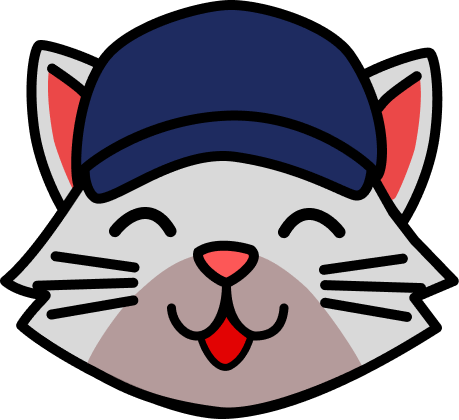

# Array Cat



## 🐾 **Overview**

Array Cat is an interactive educational game designed to teach players how to understand and manipulate arrays in programming. The protagonist, a playful cat, reacts emotionally based on the player's success in solving array-related challenges. The game combines fun gameplay with learning opportunities, making it an engaging way to practice coding concepts. While it currently focuses on JavaScript, the game aims to expand support for multiple programming languages in the future.

## Purpose

To be a tool for people who want to learn arrays and how to manipulate them in a fun and entertaining way.

## Method

The user is given the mission to help a cat who is facing challenges in a factory. This setup allows the user to engage in tasks that require array manipulation.

This turns learning arrays into an entertaining and practical challenge. It is ideal for mastering the skills learned and being able to use the acquired capabilities in any future tasks or requirements.

## 🎮 **Features**

- **Dynamic Reactions**: The cat displays happiness upon level completion and sadness when a level is lost.
- **Educational Content**: Learn how to create, modify, and manipulate arrays through interactive puzzles.
- **Engaging Levels**: Challenging scenarios designed to teach real-world coding skills.
- **User Interaction**: Intuitive controls and feedback loops to enhance the learning experience.

## 🛠️ **Technologies Used**

- **JavaScript**: Core language
- **JSON**: Database
- **CSS**: Styling
- **HTML5**: Game canvas

## 🕹️ Ready to Play?

Experience the game in action by visiting [Array Cat on GitHub Pages](https://nicurrego.github.io/ArrayGame/).

## 🐱 **How to Play**

1. Navigate through the levels using your keyboard or mouse.
2. Solve array-related challenges to progress through the game.
3. Watch the cat's emotions change based on your performance.

## 📈 **Roadmap**

\- [ ] Add more levels.

\- [ ] Expand educational content for arrays in different languages (Python, Java, etc.).

\- [ ] Implement a scoring system.

\- [ ] Create a mobile-friendly version.

\- [ ] Add support for multiple languages.🤝 **Contributing**

Contributions are welcome! Please follow these steps:

1. Fork the repository.
2. Create a new branch:
   ```bash
   git checkout -b feature-name
   ```
3. Commit your changes:
   ```bash
   git commit -m 'Add new feature'
   ```
4. Push to the branch:
   ```bash
   git push origin feature-name
   ```
5. Submit a pull request.

## 🌟 **Acknowledgements**

- Inspiration from my journey as a developer.
- Feedback from the community.

## 📄 License

Here you can specify the license under which your project is distributed (e.g. MIT, Apache 2.0).
Feel free to outline any usage or distribution restrictions.

## ❓ FAQ

**Q: Is there an easy way to test the game locally?**
A: Clone the repository and open `index.html` in your browser or run a local server.

**Q: Can I contribute in other languages besides JavaScript?**
A: Absolutely! We plan to expand and appreciate pull requests in different languages.

---

Feel free to suggest improvements or report bugs! Let’s make Array Cat even better together.

🐾 Happy coding and gaming!

